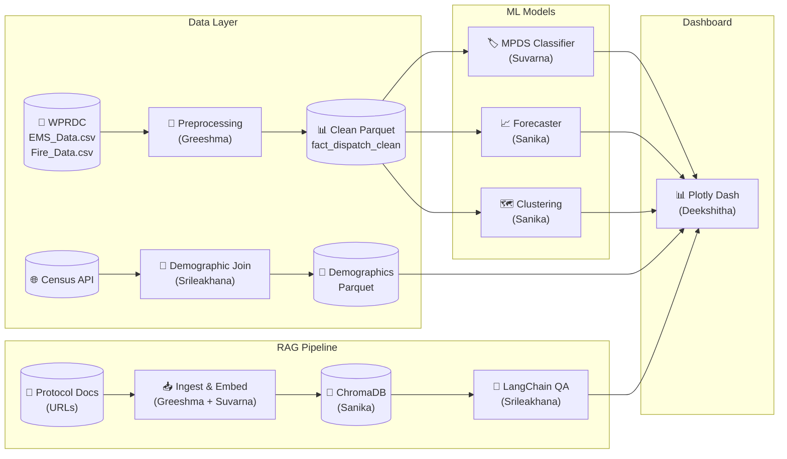

# 🚑 MedAlertAI

**AI-Powered Emergency Medical Dispatch Analytics Platform**

MedAlertAI transforms Pittsburgh EMS and Fire dispatch records into actionable intelligence through MPDS complaint classification, demand forecasting, geographic hotspot detection, and a RAG-powered protocol assistant — all accessible via an interactive Plotly Dash dashboard.

---

## Architecture



---

## Quick Start

### 1. Clone & Setup

```bash
git clone https://github.com/ssaglave/medalertai.git
cd medalertai
python -m venv venv
source venv/bin/activate       # Windows: venv\Scripts\activate
pip install -r requirements.txt
cp .env.example .env           # fill in your API keys
```

> **Note**: This repo uses **Git LFS** for large data files. Install [Git LFS](https://git-lfs.github.com/) and run `git lfs install` before cloning to automatically download the CSV data files.

### 2. Run Dashboard

```bash
python src/dashboard/app.py
# → http://localhost:8050
```

---

## Project Structure

```
medalertai/
├── config/
│   ├── contracts.py             ← Shared schemas & column contracts (ALL)
│   └── settings.py              ← Flask, paths, model defaults (Deekshitha)
├── scripts/
│   └── download_data.py         ← WPRDC data downloader (Greeshma)
├── data/
│   ├── raw/                     ← EMS_Data.csv, Fire_Data.csv (Git LFS)
│   ├── processed/               ← Clean Parquets (gitignored, regenerated)
│   └── external/                ← Census & demographic source files
├── models/
│   └── artifacts/               ← Serialized models (gitignored, regenerated)
├── notebooks/                   ← EDA Jupyter notebooks
├── src/
│   ├── data/
│   │   ├── preprocessing.py     ← NEMSIS normalization (Greeshma)
│   │   ├── mpds_mapper.py       ← Call type → MPDS mapping (Suvarna)
│   │   ├── feature_engineering.py ← Temporal/geo features (Sanika)
│   │   ├── demographic_join.py  ← Census data join (Srileakhana)
│   │   └── schemas.py           ← Pydantic validation (Deekshitha)
│   ├── models/
│   │   ├── classifier/train.py  ← LightGBM MPDS classifier (Suvarna)
│   │   ├── forecasting/train.py ← Prophet + LightGBM ensemble (Sanika)
│   │   ├── clustering/train.py  ← DBSCAN + Isolation Forest (Sanika)
│   │   └── evaluate.py          ← Unified eval harness (Deekshitha)
│   ├── rag/
│   │   ├── ingest.py            ← Protocol doc chunking (Greeshma + Suvarna)
│   │   └── chain.py             ← LangChain QA with Claude (Srileakhana)
│   └── dashboard/
│       ├── app.py               ← Dash multi-page entry point (Deekshitha)
│       ├── pages/
│       │   ├── overview.py      ← KPIs, donut, bar charts (Greeshma)
│       │   ├── temporal.py      ← Trend lines, heatmaps (Srileakhana)
│       │   ├── geography.py     ← Choropleth, clusters (Sanika)
│       │   ├── forecast.py      ← Forecast + model toggle (Deekshitha)
│       │   ├── qa.py            ← Classification QA (Suvarna)
│       │   └── assistant.py     ← RAG chat interface (Srileakhana)
│       ├── components/
│       │   ├── filters.py       ← Global filter bar (Deekshitha)
│       │   ├── map_utils.py     ← Choropleth helpers (Deekshitha)
│       │   └── chat_ui.py       ← Chat component (Deekshitha)
│       └── assets/
│           └── custom.css
└── tests/
    ├── test_data.py             ← Data pipeline tests (Greeshma)
    ├── test_models.py           ← ML model tests (Suvarna + Sanika)
    ├── test_rag.py              ← RAG pipeline tests (Srileakhana + Deekshitha)
    └── test_dashboard.py        ← Dashboard integration tests (Deekshitha)
```

---

## Data

### Source

Pittsburgh EMS and Fire dispatch records from the [Western Pennsylvania Regional Data Center (WPRDC)](https://data.wprdc.org/dataset/ems-fire-dispatch-data).

| File | Rows | Size | Content |
|---|---|---|---|
| `EMS_Data.csv` | ~2.3M | 398 MB | EMS dispatch records (2015–2025) |
| `Fire_Data.csv` | ~985K | 165 MB | Fire dispatch records (2015–2025) |

### Columns

| Column | Description |
|---|---|
| `call_id_hash` | Anonymized incident ID |
| `service` | EMS or Fire |
| `priority` / `priority_desc` | Priority code and description |
| `call_quarter` / `call_year` | Time period |
| `description_short` | Call type (e.g., FALL, CHEST PAIN, NATURAL GAS ISSUE) |
| `city_code` / `city_name` | Municipality |
| `geoid` | Census block group FIPS code |
| `census_block_group_center__x/y` | Block group centroid (lon/lat) |

---

## Dashboard Pages

| Page | Route | Owner | Description |
|---|---|---|---|
| **Overview** | `/` | Greeshma | KPIs, EMS vs Fire donut, top-10 MPDS bar, stacked area |
| **Temporal** | `/temporal` | Srileakhana | Quarterly trends, anomaly markers, day-hour heatmap |
| **Geography** | `/geography` | Sanika | Choropleth map, DBSCAN clusters, response equity |
| **Forecast** | `/forecast` | Deekshitha | 4-quarter forecast, model comparison toggle |
| **Classification QA** | `/classification-qa` | Suvarna | Agreement table, data quality, compliance trends |
| **Assistant** | `/assistant` | Srileakhana | RAG-powered protocol Q&A with Claude |

---

## ML Model Targets

| Model | Metric | Target |
|---|---|---|
| MPDS Classifier | Macro F1 | > 0.75 |
| Demand Forecaster | MAPE | < 15% |
| Hotspot Detection | Silhouette Score | > 0.4 |
| Hotspot Detection | Recall@20 | > 0.7 |
| RAG Pipeline | Precision@5 | > 0.6 |
| RAG Pipeline | Latency p50 | < 3s |

---

## Team

| Role | Name | Primary Domain |
|---|---|---|
| C1 | **Greeshma** | Data Engineering & Ingestion |
| C2 | **Suvarna** | ML — Classification & QA |
| C3 | **Sanika** | ML — Forecasting & Clustering |
| C4 | **Srileakhana** | RAG Pipeline & LLM |
| C5 | **Deekshitha** | Dashboard (Plotly Dash) & Testing |

---

## Development Workflow

### Branch Strategy

```
main                  ← protected, always working
├── dev               ← integration branch
├── c1/greeshma       ← Data Engineering
├── c2/suvarna        ← ML Classification
├── c3/sanika         ← ML Forecasting & Clustering
├── c4/srileakhana    ← RAG Pipeline
└── c5/deekshitha     ← Dashboard & Testing
```

### Setup Your Branch

```bash
git checkout -b dev origin/main
git checkout -b c1/greeshma dev       # (replace with your branch)
```

### PR Flow

1. Push to your feature branch
2. Open PR → `dev`
3. Get at least 1 review
4. Merge to `dev`
5. Periodically: `dev` → `main` after integration testing

> ⚠️ Changes to `config/contracts.py` require **all 5 contributors to approve**.

---

## Tech Stack

| Category | Tools |
|---|---|
| **Dashboard** | Plotly Dash, Dash Bootstrap Components |
| **Visualization** | Plotly Express, Plotly Graph Objects |
| **ML** | LightGBM, XGBoost, Prophet, scikit-learn, Optuna |
| **RAG** | LangChain, ChromaDB, sentence-transformers, Claude claude-haiku-4-5 |
| **Geospatial** | GeoPandas, Plotly Mapbox |
| **Data** | Pandas, PyArrow, Pydantic |
| **Experiment Tracking** | MLflow |
| **Testing** | pytest, pytest-cov |
| **Deployment** | Flask (built-in dev server) |

---

## License

MIT
