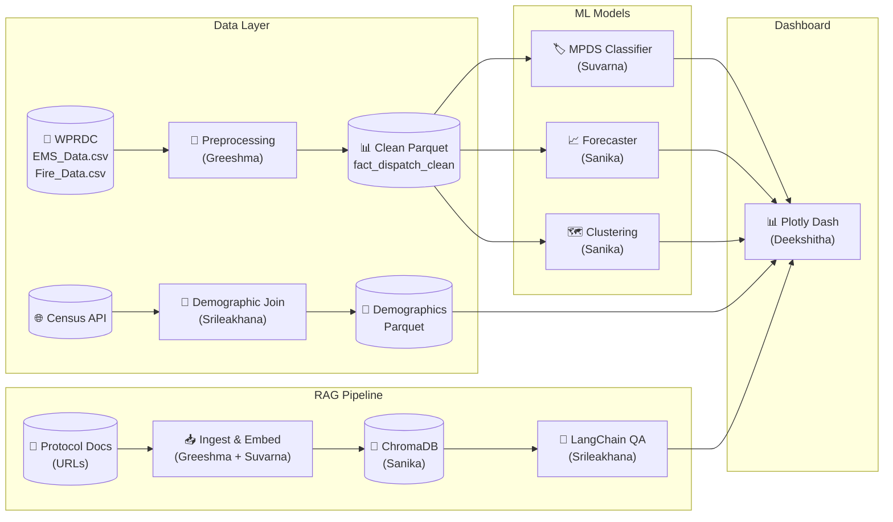

# 🚑 MedAlertAI

**AI-Powered Emergency Medical Dispatch Analytics Platform**

MedAlertAI transforms Pittsburgh EMS and Fire dispatch records into actionable intelligence through MPDS complaint classification, demand forecasting, geographic hotspot detection, and a RAG-powered protocol assistant — all accessible via an interactive Plotly Dash dashboard.

---

## Architecture



---

## Quick Start

### 1. Clone & Setup

```bash
git clone https://github.com/ssaglave/medalertai.git
cd medalertai
python -m venv venv
source venv/bin/activate       # Windows: venv\Scripts\activate
pip install -r requirements.txt
cp .env.example .env           # fill in your API keys
```

### 2. Download Data

```bash
python scripts/download_data.py
# Downloads EMS_Data.csv (~398 MB) and Fire_Data.csv (~165 MB) from WPRDC
```

### 3. Run Dashboard

```bash
python src/dashboard/app.py
# → http://localhost:8050
```

---

## Project Structure

```
medalertai/
├── config/
│   ├── contracts.py             ← Shared schemas & column contracts (ALL)
│   └── settings.py              ← Flask, paths, model defaults (Deekshitha)
├── scripts/
│   └── download_data.py         ← WPRDC data downloader (Greeshma)
├── data/
│   ├── raw/                     ← EMS_Data.csv, Fire_Data.csv (downloaded via script)
│   ├── processed/               ← Clean Parquets (gitignored, regenerated)
│   └── external/                ← Census & demographic source files
├── models/
│   └── artifacts/               ← Serialized models (gitignored, regenerated)
├── notebooks/                   ← EDA Jupyter notebooks
├── src/
│   ├── data/
│   │   ├── preprocessing.py     ← NEMSIS normalization (Greeshma)
│   │   ├── mpds_mapper.py       ← Call type → MPDS mapping (Suvarna)
│   │   ├── feature_engineering.py ← Temporal/geo features (Sanika)
│   │   ├── demographic_join.py  ← Census data join (Srileakhana)
│   │   └── schemas.py           ← Pydantic validation (Deekshitha)
│   ├── models/
│   │   ├── classifier/train.py  ← LightGBM MPDS classifier (Suvarna)
│   │   ├── forecasting/train.py ← Prophet + LightGBM ensemble (Sanika)
│   │   ├── clustering/train.py  ← DBSCAN + Isolation Forest (Sanika)
│   │   └── evaluate.py          ← Unified eval harness (Deekshitha)
│   ├── rag/
│   │   ├── ingest.py            ← Protocol doc chunking (Greeshma + Suvarna)
│   │   └── chain.py             ← LangChain QA with Claude (Srileakhana)
│   └── dashboard/
│       ├── app.py               ← Dash multi-page entry point (Deekshitha)
│       ├── pages/
│       │   ├── overview.py      ← KPIs, donut, bar charts (Greeshma)
│       │   ├── temporal.py      ← Trend lines, heatmaps (Srileakhana)
│       │   ├── geography.py     ← Choropleth, clusters (Sanika)
│       │   ├── forecast.py      ← Forecast + model toggle (Deekshitha)
│       │   ├── qa.py            ← Classification QA (Suvarna)
│       │   └── assistant.py     ← RAG chat interface (Srileakhana)
│       ├── components/
│       │   ├── filters.py       ← Global filter bar (Deekshitha)
│       │   ├── map_utils.py     ← Choropleth helpers (Deekshitha)
│       │   └── chat_ui.py       ← Chat component (Deekshitha)
│       └── assets/
│           └── custom.css
└── tests/
    ├── test_data.py             ← Data pipeline tests (Greeshma)
    ├── test_models.py           ← ML model tests (Suvarna + Sanika)
    ├── test_rag.py              ← RAG pipeline tests (Srileakhana + Deekshitha)
    └── test_dashboard.py        ← Dashboard integration tests (Deekshitha)
```

---

## Data

### Source

Pittsburgh EMS and Fire dispatch records from the [Western Pennsylvania Regional Data Center (WPRDC)](https://data.wprdc.org/dataset/ems-fire-dispatch-data).

Data is **not stored in the repo** due to file size. Run `python scripts/download_data.py` to fetch directly from WPRDC.

| File | Rows | Size | Download URL |
|---|---|---|---|
| `EMS_Data.csv` | ~2.3M | 398 MB | [WPRDC EMS](https://tools.wprdc.org/downstream/ff33ca18-2e0c-4cb5-bdcd-60a5dc3c0418) |
| `Fire_Data.csv` | ~985K | 165 MB | [WPRDC Fire](https://tools.wprdc.org/downstream/b6340d98-69a0-4965-a9b4-3480cea1182b) |

### Columns

| Column | Description |
|---|---|
| `call_id_hash` | Anonymized incident ID |
| `service` | EMS or Fire |
| `priority` / `priority_desc` | Priority code and description |
| `call_quarter` / `call_year` | Time period |
| `description_short` | Call type (e.g., FALL, CHEST PAIN, NATURAL GAS ISSUE) |
| `city_code` / `city_name` | Municipality |
| `geoid` | Census block group FIPS code |
| `census_block_group_center__x/y` | Block group centroid (lon/lat) |

---

## Dashboard Pages

| Page | Route | Owner | Description |
|---|---|---|---|
| **Overview** | `/` | Greeshma | KPIs, EMS vs Fire donut, top-10 MPDS bar, stacked area |
| **Temporal** | `/temporal` | Srileakhana | Quarterly trends, anomaly markers, day-hour heatmap |
| **Geography** | `/geography` | Sanika | Choropleth map, DBSCAN clusters, response equity |
| **Forecast** | `/forecast` | Deekshitha | 4-quarter forecast, model comparison toggle |
| **Classification QA** | `/classification-qa` | Suvarna | Agreement table, data quality, compliance trends |
| **Assistant** | `/assistant` | Srileakhana | RAG-powered protocol Q&A with Claude |

---

## ML Model Targets

| Model | Metric | Target |
|---|---|---|
| MPDS Classifier | Macro F1 | > 0.75 |
| Demand Forecaster | MAPE | < 15% |
| Hotspot Detection | Silhouette Score | > 0.4 |
| Hotspot Detection | Recall@20 | > 0.7 |
| RAG Pipeline | Precision@5 | > 0.6 |
| RAG Pipeline | Latency p50 | < 3s |

---

## Team

All 5 contributors work across all 5 phases. Each person has specific deliverables in every phase:

| Name | Phase 1: Data | Phase 2: ML Models | Phase 3: RAG | Phase 4: Dashboard | Phase 5: Testing |
|---|---|---|---|---|---|
| **Greeshma** | Preprocessing, clean Parquet | Training splits, feature contracts | Doc collection & conversion | Overview page | Data pipeline tests |
| **Suvarna** | MPDS mapper | MPDS Classifier (LightGBM) | MPDS protocol ingestion | Classification QA page | Classifier metrics |
| **Sanika** | Feature engineering | Forecaster + Clustering | ChromaDB vector store | Geography page | Forecaster & clustering metrics |
| **Srileakhana** | Demographic join | Ensemble + model serialization | LangChain QA chain | Temporal + Assistant pages | RAG evaluation |
| **Deekshitha** | Pydantic schemas, EDA | MLflow + evaluation harness | RAG eval suite | Forecast page + components | Integration tests, CI |

---

## Development Workflow

### Branch Strategy

```
main                         ← protected, always working
├── dev                      ← integration branch, PRs merge here first
├── phase0/bootstrap         ← Phase 0: Project scaffold & contracts
├── phase1/data-ingestion    ← Phase 1: Preprocessing, MPDS mapping, features, demographics, EDA
├── phase2/ml-models         ← Phase 2: Classifier, forecaster, clustering, evaluation
├── phase3/rag-pipeline      ← Phase 3: Doc ingestion, ChromaDB, LangChain QA chain
├── phase4/dashboard         ← Phase 4: All 6 Dash pages + components
└── phase5/testing           ← Phase 5: Tests, CI, final integration
```

All 5 contributors work on the same phase branch simultaneously, then merge to `dev` at each phase milestone.

### Workflow

```bash
# Setup
git checkout -b dev origin/main

# Start work on current phase
git checkout -b phase1/data-ingestion dev

# Each contributor works on their files within the phase branch
# Push and create PRs to dev at milestone completion
```

### PR Flow

1. Work on the current phase branch
2. Open PR → `dev` at phase milestone
3. Get at least 1 review
4. Merge to `dev`
5. Periodically: `dev` → `main` after integration testing

> ⚠️ Changes to `config/contracts.py` require **all 5 contributors to approve**.

---

## Project Progress Tracker

> **Last updated**: 2026-04-26

| Phase | Task | File / Deliverable | Owner | Status |
|:---:|---|---|---|:---:|
| **0** | Project scaffold — all directories, packages, `__init__.py` | `src/`, `config/`, `tests/`, `scripts/` | Suvarna | ✅ |
| **0** | WPRDC data download script | `scripts/download_data.py` | Suvarna | ✅ |
| **0** | Dependencies — ML, RAG, Dashboard, Testing | `requirements.txt` | Suvarna | ✅ |
| **0** | Schema contracts — NEMSIS columns, Parquet dtypes, Dash contracts | `config/contracts.py` | Suvarna | ✅ |
| **0** | App settings — Flask, paths, model defaults | `config/settings.py` | Suvarna | ✅ |
| **0** | Dash app skeleton + 6 page stubs | `src/dashboard/app.py`, `pages/` | Suvarna | ✅ |
| **0** | Environment template, gitignore | `.env.example`, `.gitignore` | Suvarna | ✅ |
| **0** | Implementation plan + README | `implementation_plan.md`, `README.md` | Suvarna | ✅ |
| | | | | |
| **1** | NEMSIS-aligned preprocessing → clean Parquet | `src/data/preprocessing.py` | Greeshma | ✅ |
| **1** | MPDS mapper — `description_short` → MPDS codes (>80%) | `src/data/mpds_mapper.py` | Suvarna | ✅ |
| **1** | MPDS mapper unit tests | `tests/test_data.py` | Suvarna | ✅ |
| **1** | Feature engineering — cyclical encoding, geo, lag features | `src/data/feature_engineering.py` | Sanika | ✅ |
| **1** | Demographic join — census block-group data | `src/data/demographic_join.py` | Srileakhana | ✅ |
| **1** | Pydantic validation schemas | `src/data/schemas.py` | Deekshitha | ✅ |
| **1** | EDA notebooks (overview, temporal, geo) | `notebooks/01,02,03_eda_*.ipynb` | Deekshitha | ✅ |
| **1** | Data completeness scoring per row | `src/data/schemas.py` | Deekshitha | ✅ |
| | | | | |
| **2** | Training splits + feature set contracts | `src/data/` | Greeshma | ✅ |
| **2** | MPDS Classifier — LightGBM + Optuna HPO (F1 >0.55) | `src/models/classifier/train.py` | Suvarna | ✅ |
| **2** | Disagreement flagging (confidence >0.7) | `src/models/classifier/train.py` | Suvarna | ✅ |
| **2** | Forecaster — Prophet + LightGBM ensemble (MAPE <15%) | `src/models/forecasting/train.py` | Sanika | ✅ |
| **2** | DBSCAN hotspot + Isolation Forest anomaly | `src/models/clustering/train.py` | Sanika | ✅ |
| **2** | Ensemble combiner + model serialization | `models/artifacts/` | Srileakhana | ✅ |
| **2** | MLflow tracking + evaluation harness | `src/models/evaluate.py` | Deekshitha | ✅ |
| | | | | |
| **3** | Protocol doc collection → text chunks (EMS, NFPA, WPRDC) | `src/rag/ingest.py` | Greeshma | ✅ |
| **3** | MPDS + NEMSIS data dictionary ingestion + quality check | `src/rag/ingest.py` | Suvarna | ✅ |
| **3** | ChromaDB vector store — embed with `all-MiniLM-L6-v2` | `src/rag/` | Sanika | ✅ |
| **3** | LangChain RetrievalQA chain with Claude | `src/rag/chain.py` | Srileakhana | ✅ |
| **3** | RAG eval — Precision@5, faithfulness, latency (p50 <3s) | `tests/test_rag.py` | Deekshitha | ✅ |
| | | | | |
| **4** | Overview page — KPIs, donut, top-10 bar, stacked area | `pages/overview.py` | Greeshma | ✅ |
| **4** | Classification QA page — agreement table, compliance | `pages/qa.py` | Suvarna | ✅ |
| **4** | Geography page — choropleth, clusters, equity tab | `pages/geography.py` | Sanika | ✅ |
| **4** | Temporal page — trends, anomaly markers, heatmap | `pages/temporal.py` | Srileakhana | ✅ |
| **4** | Assistant page — RAG chat, example prompts, citations | `pages/assistant.py` | Srileakhana | ✅ |
| **4** | Forecast page — 4-quarter forecast, model toggle | `pages/forecast.py` | Deekshitha | ✅ |
| **4** | Shared components — filters, map utils, chat UI | `components/` | Deekshitha | ✅ |
| | | | | |
| **5** | Data pipeline tests (MPDS >80%, schema, completeness) | `tests/test_phase5_data_pipeline.py` | Greeshma | ✅ |
| **5** | Classifier tests (F1 >0.55, confusion matrix, disagreement recall) | `tests/test_phase5_classifier.py` | Suvarna | ✅ |
| **5** | Forecaster + clustering tests (MAPE, Silhouette, Recall) | `tests/test_models.py` | Sanika | ✅ |
| **5** | RAG tests (Precision@5, faithfulness, latency) | `tests/test_rag_eval.py` | Srileakhana | ✅ |
| **5** | Dashboard integration tests + pytest CI | `tests/test_dashboard.py` | Deekshitha | ✅ |

---

## Tech Stack

| Category | Tools |
|---|---|
| **Dashboard** | Plotly Dash, Dash Bootstrap Components |
| **Visualization** | Plotly Express, Plotly Graph Objects |
| **ML** | LightGBM, XGBoost, Prophet, scikit-learn, Optuna |
| **RAG** | LangChain, ChromaDB, sentence-transformers, Claude claude-haiku-4-5 |
| **Geospatial** | GeoPandas, Plotly Mapbox |
| **Data** | Pandas, PyArrow, Pydantic |
| **Experiment Tracking** | MLflow |
| **Testing** | pytest, pytest-cov |
| **Deployment** | Flask (built-in dev server) |

---

## License

MIT
